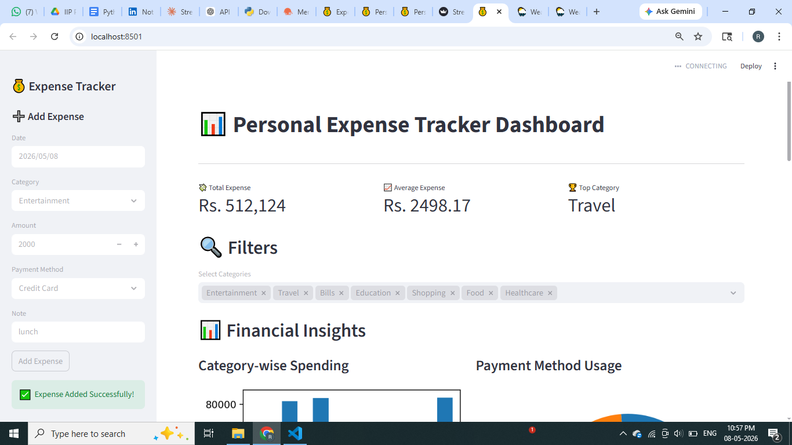
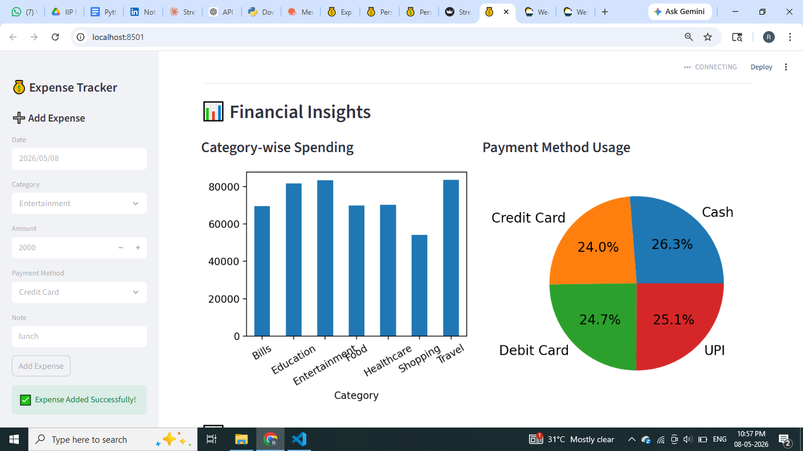
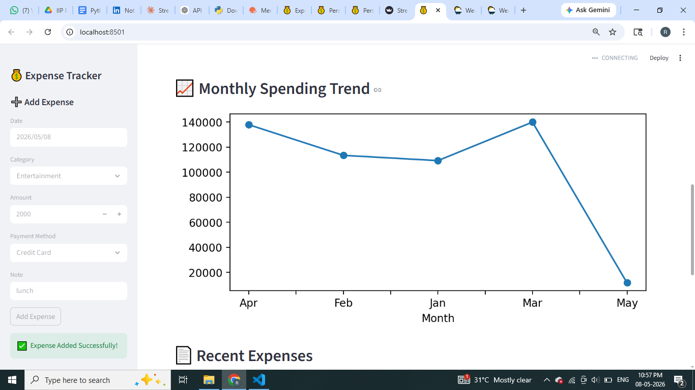
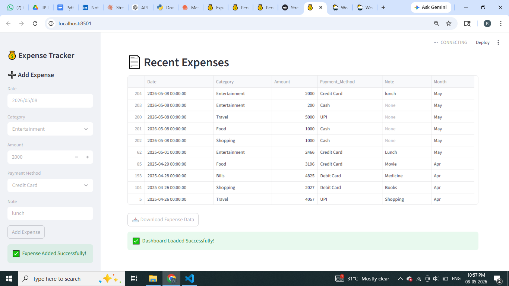
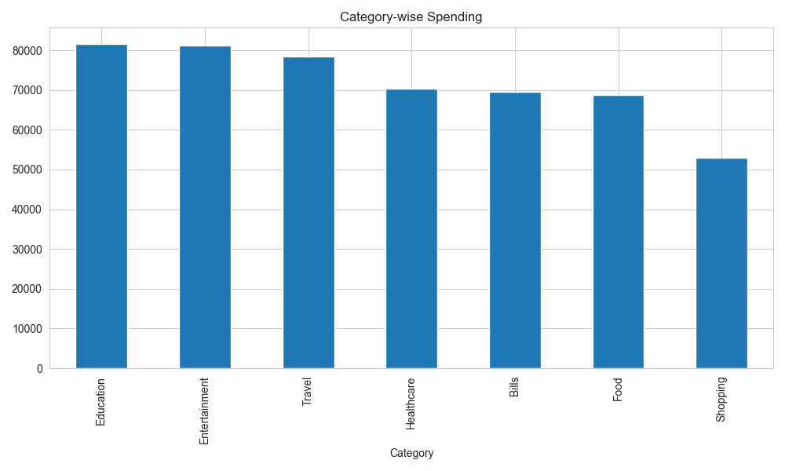
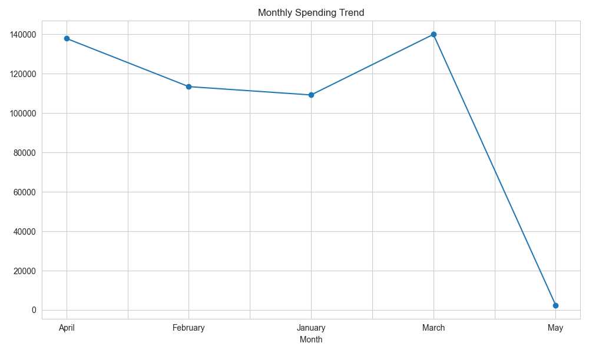
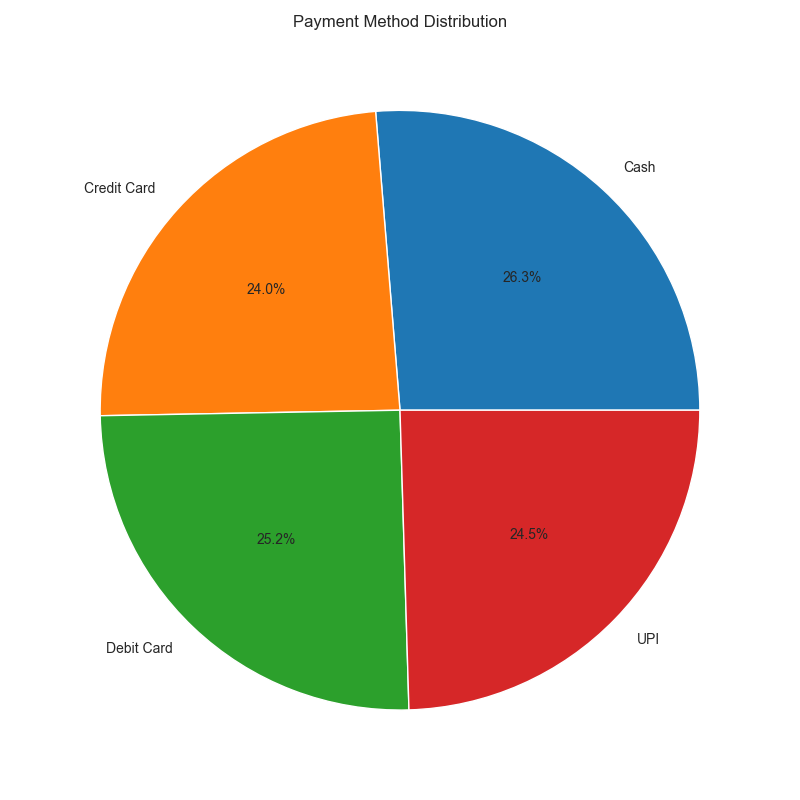
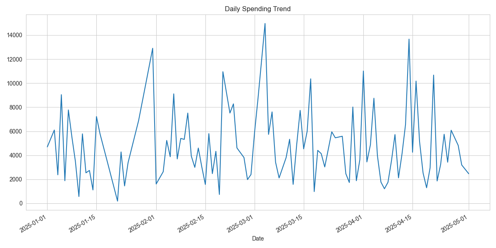

# 💰 Personal Expense Tracker with Data Visualization

## 📌 Project Overview

Personal Expense Tracker is a Python-based financial analytics project that helps users track, analyze, and visualize their daily expenses using an interactive Streamlit dashboard.

The system allows users to:
- Add personal expenses manually
- Track spending habits
- Analyze category-wise expenses
- Monitor monthly spending trends
- Generate financial insights
- Download expense reports

This project demonstrates practical implementation of:
- Data Analysis
- Financial Analytics
- Data Visualization
- Dashboard Development
- CSV Data Handling
- Report Automation

---

# 🚀 Features

✅ Manual Expense Entry  
✅ Interactive Streamlit Dashboard  
✅ Real-time Expense Tracking  
✅ Category-wise Expense Analysis  
✅ Monthly Spending Trend Analysis  
✅ Payment Method Insights  
✅ Download Expense Data as CSV  
✅ Financial Charts & Visualizations  
✅ Automated Report Generation  
✅ Responsive Dashboard UI  

---

# 🛠️ Tech Stack

| Technology | Purpose |
|---|---|
| Python | Core Programming |
| Pandas | Data Analysis |
| NumPy | Numerical Operations |
| Matplotlib | Data Visualization |
| Seaborn | Statistical Visualization |
| Streamlit | Interactive Dashboard |
| CSV | Data Storage |

---

# 📂 Project Structure

```text
Personal-Expense-Tracker-Visualization/
│
├── data/
│   └── expense_data.csv
│
├── src/
│   ├── data_generator.py
│   ├── data_loader.py
│   ├── data_cleaning.py
│   ├── analysis.py
│   ├── visualization.py
│   └── report_generator.py
│
├── dashboard/
│   └── app.py
│
├── images/
│   ├── dashboard.png
│   ├── category_spending.png
│   ├── monthly_trend.png
│   ├── payment_method.png
│   └── daily_spending.png
│
├── outputs/
├── reports/
├── requirements.txt
├── README.md
└── main.py
```

---

# ⚙️ Installation

## Clone Repository

```bash
git clone YOUR_GITHUB_REPOSITORY_LINK
```

---

## Create Virtual Environment

### Windows

```bash
python -m venv env
env\Scripts\activate
```

### Mac/Linux

```bash
python3 -m venv env
source env/bin/activate
```

---

## Install Dependencies

```bash
pip install -r requirements.txt
```

---

# ▶️ Run Project

## Run Main Python Project

```bash
python main.py
```

---

## Run Streamlit Dashboard

```bash
streamlit run dashboard/app.py
```

---

# 📊 Dashboard Preview

## Main Dashboard






---

# 📈 Visualizations

## Category-wise Spending



---

## Monthly Spending Trend



---

## Payment Method Analysis



---

## Daily Spending Trend



---

# 🎥 Demo Video

## Project Demo

[▶️ Watch Demo Video](https://drive.google.com/file/d/17eJjryuV-KnWHdawpSOap-sknKq4Vxlk/view?usp=drive_link)

> Upload your screen recording inside the `images/` folder and rename it:
>
> ```text
> demo_video.mp4
> ```

---

# 📄 Sample Outputs

Generated outputs include:
- Expense reports
- CSV analysis files
- Financial charts
- Dashboard analytics

---

# 📌 Industry Relevance

This project is useful for demonstrating skills related to:

- Python Development
- Data Analysis
- Business Analytics
- Financial Analytics
- Dashboard Development
- Automation Engineering

---

# 🎯 Learning Outcomes

Through this project, I learned:
- Data preprocessing using Pandas
- Financial data analysis
- Interactive dashboard development
- Data visualization techniques
- CSV handling and automation
- GitHub project management

---

# 📥 Future Improvements

- User Authentication
- Budget Alerts
- Expense Prediction using ML
- Database Integration
- Cloud Deployment
- Mobile Responsive Dashboard

---

# 🙌 Acknowledgement

Special thanks to Umesh Yadav Sir for the guidance and support throughout the project.

---

# 📧 Contact

If you found this project useful, feel free to connect and provide feedback.

---
